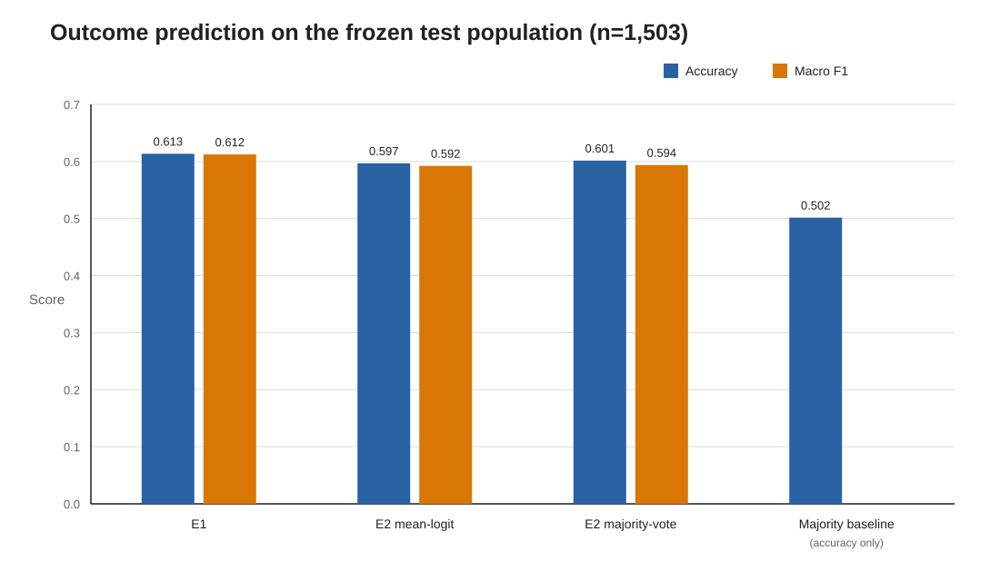
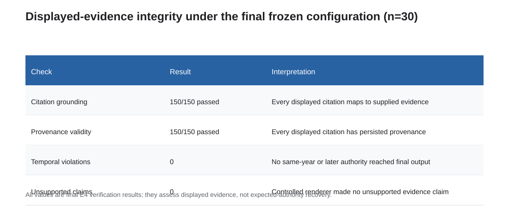
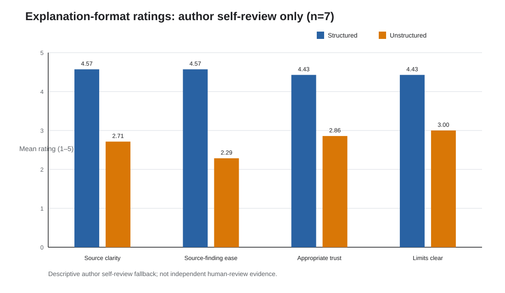

# Temporally Constrained and Provenance-Verified Legal Research over Indian Supreme Court Judgments

## Abstract

AI-assisted legal research can fail even when its prose appears plausible: a cited authority may not exist, may not contain the attributed passage, may post-date the matter being analyzed, or may never have been retrieved. This work develops and evaluates a temporally constrained, provenance-preserving evidence pipeline for historical Indian Supreme Court judgments. The implementation uses a purpose-split design: ILDC Single supports two facts-only outcome baselines, while a 39,069-PDF eCourts-derived collection supports precedent retrieval and citation verification. A corpus audit repaired 12 of 15 PDF instances with corrupted embedded text and transparently excluded three. A separate alignment audit showed that only 11 of 5,391 superficially matching ILDC/eCourts identifiers passed content alignment, motivating a reusable content-alignment gate instead of naive identifier matching. On 1,503 eligible ILDC test cases, TF-IDF with logistic regression achieved 0.6134 accuracy and 0.6123 macro F1, exceeding corrected InLegalBERT chunk-and-pool results of 0.5968 and 0.5924. On 30 source-verified evidence cases, the final pre-ranking temporal configuration recovered 12 expected authorities in the five displayed sources and 15 within the top 100. All 150 displayed citations passed grounding, provenance, and temporal checks, with no unsupported claims. A seven-case author self-review preferred structured explanations in all pairs, but this is not independent user evidence. The central finding is therefore bounded: deterministic temporal and provenance controls can make displayed evidence fully auditable, while authority recovery remains incomplete and must be evaluated separately.

## 1. Introduction

Legal research systems operate in a domain where fluent output is not enough. A response can be linguistically convincing while citing a nonexistent case, attributing a nonexistent paragraph to a real case, or relying on law that was unavailable at the relevant time. In *Pooja Ramesh Singh v. Jammu and Kashmir Bank Ltd. & Anr.*, 2026 INSC 668, the Supreme Court of India set aside tribunal decisions after identifying nonexistent authorities, incorrect citations, and fabricated passages apparently produced through AI-assisted research. The Court distinguished legitimate assistance from unverified reliance and emphasized continued human control over adjudication ([Supreme Court judgment hosted by the Insolvency and Bankruptcy Board of India](https://ibbi.gov.in/uploads/order/8e1ccab8f7b445f81034223c1d0fe7b9.pdf)). The case makes a practical systems point: legal AI requires evidence that a reviewer can locate, inspect, and verify, not merely an answer that sounds legal.

This project addresses that systems problem in a historical Indian Supreme Court setting. Given facts extracted from an ILDC judgment, the evidence pipeline retrieves earlier Supreme Court materials, retains stable source and passage locators, excludes the query judgment and aligned duplicates, renders only selected verbatim evidence, and verifies each displayed citation against the persisted corpus and retrieval run. The design intentionally does not ask the retrieval stages to predict the case outcome. Outcome classification remains a separate baseline task, allowing evidence-retrieval quality to be measured without conflating it with prediction accuracy.

The work makes four project-specific contributions. First, it constructs an auditable dual-corpus workflow joining ILDC outcome cases to an eCourts-derived evidence collection through content validation. The audit quantifies a substantial identifier-namespace problem: 5,391 superficial ID matches yielded only 11 content-aligned pairs. Second, it documents three bounded retrieval corrections—full-input salient query terms, a coverage-qualified self-match guard, and temporal filtering before BM25 ranking—and freezes the resulting configuration. Third, it evaluates expected-authority recovery separately from citation grounding, provenance, and temporal integrity, showing that perfect verification of displayed evidence can coexist with incomplete retrieval recall. Fourth, it compares a sparse outcome baseline with corrected long-document InLegalBERT and records a small, explicitly non-independent observation about structured explanation format.

The claims are deliberately narrow. The project does not establish legal correctness for every retrieved authority, deploy an autonomous legal advisor, or show that evidence retrieval improves outcome prediction. It evaluates a research prototype on three distinct populations: 1,503 outcome cases, 30 source-verified evidence cases, and seven paired explanation examples.

## 2. Problem Definition and Scope

Let a historical query judgment have ILDC identifier `q`, query year `Yq`, and frozen facts-only text `Fq`. Let each candidate evidence passage `p` belong to an eCourts source judgment with a stable source identifier, exact decision date, citation metadata, page and character boundaries, and stored passage text. The implemented temporal policy admits `p` only when its source decision year is strictly earlier than `Yq`. A same-year source is treated as ambiguous because ILDC supplies no exact query date, and a source with missing or unparseable date metadata is excluded.

The evidence task has three separable questions:

1. **Recovery:** Does the top-100 candidate set contain the independently verified expected authority, and is that authority included among the five displayed sources?
2. **Integrity:** Does each displayed citation reproduce a real retrieved corpus passage with exact provenance, avoid the query judgment and aligned duplicates, and satisfy the temporal rule?
3. **Presentation:** Given the same evidence and citations, does a structured Issue–Authority–Evidence–Conclusion–Uncertainty format make the material easier to inspect than unstructured prose?

Outcome prediction is a fourth, contextual task evaluated only through E1 and E2. It asks whether the ILDC binary label can be predicted from the frozen pre-decision input. E3 and E4 are evidence-retrieval-and-verification stages and do not return an outcome label. This separation prevents a high or low classification score from standing in for evidence quality and prevents a perfectly traceable citation from being mistaken for complete authority recovery.

## 3. Research Gap and Novelty Positioning

Indian legal NLP has substantial work on judgment prediction, domain-adapted language models, document structure, and emerging retrieval-augmented assistants. The remaining gap addressed here is not generic legal question answering. It is the combined auditability problem created when a historical case is linked to an external judgment corpus: source identity must be validated across datasets, candidate evidence must be restricted to material available at the query time, displayed passages must remain tied to exact provenance, and retrieval failure must remain visible even when every displayed citation is valid.

The novelty claim is therefore bounded to the evaluated workflow. The project does not claim to be the first legal RAG system, the first Indian legal model, or the first temporal legal benchmark. Its contribution is an end-to-end, reproducible combination of: (i) quantified cross-corpus content-alignment gating; (ii) conservative year-level pre-ranking eligibility; (iii) exact passage and retrieval-run verification; and (iv) separate reporting of authority recovery and citation validity on a source-first answer key. The identifier audit is independently useful: it demonstrates that mechanically similar ILDC and eCourts identifiers do not establish judgment identity and provides a reusable content-based alternative.

## 4. Related Work

| Work | Primary task and setting | Relationship to this project | Boundary of the present contribution |
|---|---|---|---|
| [ILDC for CJPE](https://aclanthology.org/2021.acl-long.313/) | Indian Supreme Court outcome prediction and explanation over ILDC | Supplies the judgment-prediction setting from which the local ILDC Single splits are drawn | This project uses a smaller fixed ILDC subset for E1/E2 and adds a separate, provenance-bearing evidence corpus; it does not reproduce ILDC's prediction architecture |
| [InLegalBERT / Indian legal pre-training](https://arxiv.org/abs/2209.06049) | Domain-adapted language models evaluated on Indian legal tasks, including court-appeal prediction | Motivates the pinned InLegalBERT E2 baseline | The present evaluation corrects long-document truncation through chunk-and-pool and does not assume domain pre-training must beat a sparse baseline |
| [TaxFlow](https://doi.org/10.1080/08839514.2026.2626097) | Hybrid RAG and temporally filtered statutory question answering for Indian tax law | Shares the concern that legal retrieval must respect changing law and authoritative sources | This project studies historical Supreme Court precedent retrieval, cross-corpus identity, exact displayed-passage provenance, and a source-verified authority key rather than tax-law answer generation |
| [CaseFacts](https://arxiv.org/abs/2601.17230) | U.S. Supreme Court legal claim verification and precedent retrieval with Supported, Refuted, and Overruled labels | Demonstrates that legal truth and authority validity evolve and that unrestricted retrieval can introduce noisy sources | This project uses Indian judgments, queries from historical case facts, and verifies source identity, temporal eligibility, and exact retrieval provenance rather than claim labels |
| [LexTime](https://aclanthology.org/2025.findings-emnlp.280/) | Temporal ordering of events in U.S. federal complaints | Establishes temporal reasoning as a distinct legal-language challenge | The implemented task is not event ordering; it enforces historical evidence availability through metadata before ranking |

These lines of work motivate different parts of the system, but none is used as a directly comparable numerical baseline because the jurisdictions, tasks, corpora, and denominators differ. The present paper compares only experiments run under its own frozen populations and reports external work for positioning rather than metric ranking.

## 5. Research Questions and Hypotheses

The final operational questions reflect the implemented scope:

- **RQ1 — Outcome baselines:** How do a facts-only TF-IDF logistic-regression baseline and a corrected facts-only InLegalBERT chunk-and-pool model compare on the same fixed ILDC test population?
- **RQ2 — Evidence recovery and integrity:** Under the final temporally constrained configuration, how often is a source-verified expected authority recovered at k=5 and k=100, and do displayed citations satisfy grounding, provenance, duplicate, and temporal requirements?
- **RQ3 — Explanation format:** With evidence and citations held exactly constant, how does structured presentation compare with unstructured presentation for source clarity, source-finding ease, appropriate trust, and clarity of limitations?

The plan's hypotheses are reported with their final disposition rather than rewritten to match the results:

- **H1:** Indian legal-domain pre-training will make E2 outperform the sparse E1 outcome baseline. This hypothesis was not supported on the frozen 1,503-case evaluation.
- **H2:** Moving the existing earlier-year rule before BM25 ranking will prevent ineligible documents from consuming the top-100 depth and improve authority recovery relative to post-ranking filtering. The bounded 30-case comparison supported this process hypothesis.
- **H3:** Structured evidence presentation will be preferred to unstructured presentation when citations are held constant. The seven-case author self-review was directionally consistent with this hypothesis, but its non-independence and sample size preclude a general human-subject claim.

The original plan also described an E3/E4 outcome comparison. That comparison was retired during implementation because E3 and E4 were refined into evidence stages. No outcome effect is inferred from them.

## 6. Operational Definitions

| Term | Implemented definition |
|---|---|
| Facts-only input | Text retained before the earlier of a recognized closing/dispositive cue and the 60% character cap, sentence-aligned where possible; inputs below 10% retention or 100 words are excluded |
| Temporal existence | An eCourts source has a parseable exact decision date in corpus metadata |
| Temporal applicability | For query year `Y`, an authority is eligible only if its decision year is less than `Y`; same-year, later-year, and missing-date sources are excluded |
| Temporal effectiveness | The eligibility predicate is applied in the BM25 candidate relation before ranking and `LIMIT 100`, so ineligible sources cannot consume returned depth |
| Expected-authority Recall@100 | Share of the 30 answer-key cases whose predefined authority occurs anywhere in the returned top-100 candidates |
| Expected-authority Recall@5 | Share of the 30 answer-key cases whose predefined authority is among the five selected and displayed sources |
| Provenance validity | A displayed item reproduces the stored source ID, citation, decision date, court, PDF/page/character locator, exact passage, and retrieval-run membership |
| Citation groundedness | Every material displayed proposition is the verbatim text of a supplied evidence passage and links to that evidence item |
| Authority consistency | A verified displayed source matches the answer-key authority by stable source ID, normalized citation, or normalized title plus exact decision date |
| FEER | Future-evidence exposure rate among returned retrieval candidates; same-year ambiguous items are tracked separately |
| FCER | Future-citation exposure rate among final displayed citations |
| Structured explanation | Fixed order: legal issue, applicable authorities, supporting evidence, evidence-bound conclusion, and uncertainty |
| Self-review fallback | Ratings completed by the project author after the outside-review path was unavailable; not independent human-review evidence |

## 7. Dataset and Legal Corpus

### 7.1 Purpose-split corpus design

The study used two corpora for different experimental purposes rather than treating them as interchangeable records. ILDC Single supplied the fixed case-level splits and binary outcome labels used in E1 and E2. The local release contains 7,593 judgments: 5,082 training cases, 994 validation cases, and 1,517 test cases. Both prediction systems received the same deterministically extracted pre-decision text. After the shared sufficiency rule excluded 14 test records, the common held-out prediction population contained 1,503 cases.

E3 and E4 used the Indian Supreme Court Judgments collection obtained from the public eCourts-derived archive. It provides judgment PDFs and evidence metadata absent from ILDC, including citations, exact decision dates, court and case identifiers, source paths, and page and character locators. The downloaded collection covered 1950–2020 and contained 39,069 English PDF instances. After quality repair and exclusions, 39,066 PDFs yielded 2,343,435 labeled chunks; 2,036,981 unique chunks were loaded into the PostgreSQL provenance store and SQLite FTS5 BM25 index.

This purpose split follows the information available in each source. ILDC is suitable for fixed-split outcome prediction but exposes only a year in the case identifier and lacks the citation and passage provenance needed for evidence verification. The eCourts-derived collection supports dated, traceable retrieval but is not used as a substitute outcome-label benchmark. Cross-corpus links are used only after alignment checks.

### 7.2 Source-quality audit and OCR repair

A full audit found that the stored JSONL text was valid UTF-8 but that 15 PDF instances, representing 14 source IDs, had missing or badly corrupted embedded text. The failures were concentrated in image-backed Supreme Court Reports from the 1980s and 1990s, with one mojibake-affected 2018 file. Fixed checks covered absent embedded text, control characters, mojibake markers, visible-ASCII ratio, and English-token ratio.

Only the flagged instances were rendered and processed with English Tesseract OCR at 250 DPI. Twelve passed the same post-OCR quality gate and were restored. Three one-page PDFs remained below threshold and were transparently excluded instead of being forced into the index. Raw PDFs were preserved unchanged, exclusions were recorded, and the provenance store and BM25 index were rebuilt from the accepted corpus.

### 7.3 Cross-corpus identifier alignment

Converting an eCourts identifier of the form `YYYY INSC N` to the ILDC-like string `YYYY_N` produced 5,391 syntactic candidates. Only 11 passed content alignment; 5,380 were identifier-namespace collisions. The problem was not a single offset or isolated scrape defect, and it was concentrated in legacy material where similar numeric suffixes frequently represented different judgments.

The corrected pipeline treats identifier equality only as candidate generation. A reusable gate evaluates title or party identity together with direct six-token phrase overlap before a mapping may drive deduplication or retrieval exclusion. Combining syntactic and title/party candidates yielded 8,927 deduplicated candidate pairs: 1,304 were accepted and 7,623 rejected. Retrieval also applies a full-document self-match safeguard so that an unmapped query copy can be removed without suppressing an earlier authority merely quoted by the later judgment.

This audit is a methodological contribution of the project: naive ID equality is unreliable for this dataset pair, while content-alignment gating supplies an auditable alternative usable across answer-key validation, development probes, leakage checks, and retrieval-time exclusion.

### 7.4 Source-verified authority answer key

The authority evaluation uses 30 ILDC fixed-test cases. Test membership was checked before external verification. For each accepted case, the query judgment was inspected through a primary source or accepted eCourts mirror, one earlier authority was recorded independently of system retrieval, and that authority was reconciled to the corpus through stable source ID, normalized citation, or normalized title plus exact date for parallel reporter forms.

The identifier-collision discovery triggered a read-only audit of the then-current mappings: 20 passed, nine resolved sources failed direct content alignment, and one source was unresolved. `2013_35` was relinked to a content-aligned source, and the other nine flagged records were replaced by new fixed-test cases. The final audit recorded 30/30 direct-content passes.

The sample is not era-balanced: five query cases are from the 1970s, 13 from the 1980s, nine from the 1990s, two from the 2000s, and one from the 2010s. The 1980s account for 43.3% of the sample. This resulted from source and alignment gates rather than deliberate temporal sampling and is treated as a limitation.

## 8. System Architecture

The system has four auditable layers:

1. **Corpus and alignment layer.** ILDC split files supply prediction cases and labels. Cleaned eCourts chunks retain stable source, date, citation, court, PDF, page, and character provenance. A content-aligned crosswalk and runtime content check control target-case leakage.
2. **Outcome branch.** The shared facts-only extractor feeds E1 TF-IDF/logistic regression and E2 InLegalBERT chunk-and-pool. This branch ends in binary ILDC predictions and never retrieves external evidence.
3. **Evidence branch.** Full facts-only text is converted to salient terms, matched through BM25 with earlier-year pre-ranking eligibility, and narrowed to five source-diverse passages. E3 renders only these passages in a fixed evidence-linked structure.
4. **Verification and reporting layer.** E4 verifies each displayed evidence record against the corpus and retrieval run, enforces duplicate and temporal rules, and separately compares verified sources with the source-first answer key. Versioned JSON and Markdown artifacts preserve metrics, failures, and configuration provenance.

The architecture is deliberately extractive at the answer layer. It favors inspectability over fluent synthesis: material legal text is displayed verbatim, and the conclusion is fixed non-inferential wording tied to evidence IDs.

## 9. Experimental Methodology

### 9.1 Experimental design and shared inputs

The executed study comprises four operational stages. E1 and E2 are outcome-prediction baselines evaluated on the same 1,503 eligible cases. E3 retrieves and presents provenance-linked prior authorities for a separate, source-verified subset of 30 cases. E4 applies hard citation, provenance, duplicate, and temporal checks to E3's displayed evidence. E3 and E4 do not emit outcome labels.

E1 and E2 share `ildc-predecision-facts-v1`. The extractor retains text preceding the earlier of a recognized closing/dispositive cue and 60% of the document, moving the boundary to a preceding sentence end when sufficient text remains. Cases below 10% retention or 100 words are excluded. Neither prediction path uses retrieval. Model and threshold selection uses validation data, and the held-out test split is evaluated after selection.

### 9.2 Scope refinement from plan to implementation

The original plan described E4 as producing both an outcome prediction and an evidence-verification output. During implementation, E3 and E4 were refined into pure evidence-retrieval-and-verification pipelines because the project's primary task is legal research and evidence-backed analysis, not prediction. Outcome prediction remained exclusively within E1 and E2. This separation avoids conflating outcome classification with evidence retrieval and keeps E3/E4 focused on authority recovery, citation validity, provenance, temporal integrity, and grounding.

"Prediction Delta (E4-E3)," as defined in the original plan, is therefore not computed, since neither E3 nor E4 produces an outcome label to compare. This is an explicit scope refinement, not a missing implemented metric.

### 9.3 E1: sparse linear outcome baseline

E1 uses lowercased, Unicode-normalized TF-IDF unigrams and bigrams with sublinear term frequency, minimum document frequency two, L2 normalization, and at most 100,000 features. Logistic-regression values `C = 0.1, 1.0, 10.0` are compared by validation accuracy, with smaller `C` breaking a tie. The selected `C = 10.0` pipeline is refitted once on eligible training and validation cases and evaluated once on test data. The seed is 202605.

### 9.4 E2: corrected InLegalBERT chunk-and-pool baseline

E2 fine-tunes `law-ai/InLegalBERT` revision `b5ecfed8ed6cf9d25a3cb8225a8c52f161f7401a` with a new two-label head. It supersedes a 256-token prefix run that truncated 99.20% of eligible test inputs. Each facts-only document is instead represented by overlapping 512-token windows with 50-token overlap. Training uses three epochs, seed 202607, learning rate `2e-5`, weight decay 0.01, warm-up ratio 0.1, gradient checkpointing, and gradient accumulation.

Mean pooling of window logits before softmax is primary, and checkpoint selection uses validation document-level mean-logit accuracy only. Majority vote is a secondary comparison, not a post-test selection rule. All 1,503 eligible test documents and 9,576 test windows are covered.

### 9.5 E3: temporally constrained retrieval and evidence presentation

The final query builder, `tfidf-segment-salient-terms-v1`, segments the full facts-only input, removes procedural-report boilerplate, scores terms deterministically, retains section and article cues, and emits at most 32 unique terms. These terms query SQLite FTS5 BM25 backed by PostgreSQL provenance.

The frozen configuration is `week11-bm25-salient-terms-preranked-temporal-v3`. Only judgments with decision year strictly earlier than the query year enter the candidate relation before BM25 ordering and the top-100 cutoff. Candidate sources are checked against the alignment-gated crosswalk and a direct-content self-match rule requiring at least 100 shared six-token occurrences and 80% unique candidate-source phrase coverage. A non-learned selector chooses up to five passages in BM25 order, with no more than one passage per source.

The controlled E3 renderer emits the issue, authorities, verbatim passages with provenance, an evidence-bound non-inferential conclusion, and uncertainty. It cannot retrieve, rerank, invent an authority, paraphrase a material proposition, or infer an outcome.

### 9.6 E4: citation and provenance verification

E4 receives the E3 answer, retrieval-run ID, query identity and year, and persisted corpus records. Each displayed item must exist in the corpus, reproduce its exact passage and provenance, belong to the recorded retrieval run, avoid the query and aligned duplicates, and pre-date the query year. Failure rejects the citation.

Authority consistency is separate. A verified source matches the independently constructed key by stable source ID, normalized citation, or normalized title plus exact date. A fully valid citation may therefore differ from the one expected authority without being labelled substantively irrelevant.

### 9.7 Retrieval investigation and freeze

Three bounded investigations produced the final retrieval configuration. First, full-input salient terms replaced the legacy first 32 terms, moving development-probe Recall@100 from 0/9 to 3/9 under the then-current self-match rule. Second, the self-match guard gained the 80% source-coverage condition, increasing development Recall@100 to 6/9 and withdrawing the earlier broad lexical-mismatch claim. Third, the existing earlier-year rule moved into the BM25 candidate relation. A final development check reached 7/9 at k=100; on the 30-case held-out comparison, this final change moved Recall@5 from 5/30 to 12/30 and Recall@100 from 12/30 to 15/30 without losing any of the prior 12 top-100 successes.

The nine-case development sequence and 30-case held-out temporal comparison are not one learning curve. Figure C separates them. After the final test, data versions, model revisions, seeds, query construction, candidate depth, selection cardinality, duplicate controls, temporal policy, and renderer/verifier versions were frozen.

### 9.8 Bundled-intervention caveat

E4 is not a single-variable causal ablation of E3. It jointly checks corpus existence, exact passage and provenance identity, retrieval-run membership, duplicate status, and temporal eligibility. E3 and E4 share final retrieval and selected evidence. Aggregate reliability therefore cannot be attributed to one verification component; the supported claim concerns the complete bundle.

## 10. Citation and Provenance Protocol

Every eCourts chunk has a stable identifier derived from its source path and passage location. The persisted record retains source ID, source case ID when available, citation, exact decision date, court, local PDF file, page number, character start and end, and chunk text. Retrieval runs record query ID, year, query text, index version, temporal policy, rank, score, and temporal status.

The answer renderer may expose only supplied selected evidence. Material content remains verbatim; authority cards and conclusions refer to evidence IDs. Verification then checks corpus existence, exact field equality, run membership, duplicate status, and temporal eligibility. Answer-key matching occurs only after a displayed citation has passed these checks. Parallel reporter forms are reconciled through stable source identity or normalized title and exact decision date rather than loose string similarity.

This protocol distinguishes four failure states that a single “correct citation” label would collapse: a fabricated or altered citation, a real citation not retrieved for this query, a retrieved citation that violates temporal or duplicate policy, and a fully valid citation that does not match the predefined expected authority. Keeping these states separate is necessary to locate failures accurately.

## 11. Results and Discussion

### 11.1 Scope and reporting populations

The project reports three populations: 1,503 eligible fixed ILDC test cases for outcome prediction; 30 source-verified answer-key cases and 150 displayed citations for authority recovery and verification; and seven paired cases for explanation-format review. They are not aggregated or treated as a common denominator.

### 11.2 Outcome prediction

E1 achieved accuracy 0.6134 and macro F1 0.6123. Corrected E2 mean-logit pooling achieved accuracy 0.5968 and macro F1 0.5924; its secondary majority-vote result was 0.6015 accuracy and 0.5937 macro F1. Both primary models exceeded majority-class accuracy of 0.5017, while E1 led E2 on this frozen task.

*Figure A. Accuracy and macro F1 for E1, corrected E2 mean-logit and majority-vote pooling, and the majority baseline on the eligible ILDC test population (n=1,503).*

This result does not show that domain pre-training is generally ineffective. It shows that, under the implemented facts extraction, data size, training budget, window aggregation, and frozen settings, the sparse baseline performed better. The per-case disagreement analysis below also shows non-identical errors.

### 11.3 Authority recovery, grounding, and temporal integrity

On the 30-case answer-key subset, expected-authority Recall@5 was 0.40 (12/30) and Recall@100 was 0.50 (12 selected + 3 retrieved-but-unselected = 15/30 found within k=100). The remaining 15 authorities were absent at k=100.

Authority-consistency precision was 0.080000, recall 0.400000, and F1 0.133333. The precision denominator is 150 displayed citations, not raw candidates. Because the renderer displays five citations per case and the key credits one authority, the fixed-cardinality ceiling is 30/150 = 0.200000. Observed precision is 40% of that ceiling. The superseded post-ranking round displayed 135/30 = 4.5 citations per case, whereas the final pre-ranking round displays exactly 150/30 = 5; this expected shift follows ineligible candidates no longer consuming returned depth.

All 150 displayed citations were grounded, provenance-valid, and temporally eligible, with zero unsupported claims. Verification success and authority recovery are therefore distinct: the system can verify everything it displays without retrieving every expected source.

*Figure B. Expected-authority recovery on the source-verified answer-key subset (n=30): 12 selected, three retrieved but unselected, and 15 absent at k=100.*

*Figure D. Displayed-evidence integrity under the final configuration (n=30 queries; 150 displayed citations): 150/150 grounding and provenance checks passed, with no temporal violations or unsupported claims.*

### 11.4 Retrieval mechanism

The final figures followed three bounded changes: full-input salient terms replaced opening first-term queries; the direct self-match guard was repaired to distinguish quotation from source copying; and the earlier-year predicate moved before BM25 ranking. The last change increased held-out Recall@5 from 5/30 to 12/30 and Recall@100 from 12/30 to 15/30, with no regression among prior top-100 successes.

*Figure C. Retrieval investigation pathway. The nine-case development probe covers the salient-query and self-match repairs; the separate held-out comparison (n=30) covers the move from post-ranking to pre-ranking temporal filtering.*

The `2013_35`/`1980_105` contrast shows why temporal candidate capacity is not the only factor. The former remained absent despite 79 eligible candidates in its earlier raw top 100, whereas the latter was recovered despite only three eligible candidates and became a top-five hit. Residual lexical and ranking limitations remain.

### 11.5 Explanation-format observation

The seven-case paired review was an author self-review fallback, not independent reviewer evidence. Structured presentation was preferred in 7/7 pairs. Structured versus unstructured mean ratings were 4.57 versus 2.71 for source clarity, 4.57 versus 2.29 for source-finding ease, 4.43 versus 2.86 for appropriate trust, and 4.43 versus 3.00 for clarity of limitations. The perceived advantage was largest when displayed evidence included apparent retrieval noise and narrower for two coherent cases.

*Figure E. Structured and unstructured rubric means from the author self-review fallback (n=7 paired cases; not independent human-review evidence).*

The observation concerns navigation and perceived trust, not legal correctness. The self-review also identified a system-level weakness: identical generic uncertainty wording did not respond to the evidence quality of `2013_35`.

## 12. Error Analysis

### 12.1 Analysis protocol and outcome disagreement

The analysis is read-only and uses only final frozen outputs. Reconstructed E1 and inference-only E2 predictions exactly reproduced their metrics before per-case joining. Across 1,503 cases, both were correct on 684 and both wrong on 368; E1 alone was correct on 238 and E2 alone on 213. In the 30-case evidence subset, both were correct on 18, E1 alone on three, E2 alone on three, and both were wrong on six.

| Population | Both correct | E1 only correct | E2 only correct | Both wrong |
|---|---:|---:|---:|---:|
| Full fixed-test population | 684/1,503 | 238/1,503 | 213/1,503 | 368/1,503 |
| Answer-key subset | 18/30 | 3/30 | 3/30 | 6/30 |

These patterns show complementary errors without changing E1's aggregate lead. They do not support an outcome-label comparison with E3/E4.

### 12.2 Exhaustive authority-recovery buckets

| Retrieval outcome | Count | Cases |
|---|---:|---|
| Retrieved and selected | 12/30 | `2008_1629`, `1995_322`, `1995_375`, `1986_176`, `1977_99`, `1981_187`, `1980_222`, `1980_105`, `1995_425`, `2002_944`, `1982_29`, `1988_96` |
| Retrieved but not selected | 3/30 | `1980_133` (rank 15), `1981_55` (rank 28), `1985_40` (rank 78) |
| Absent at k=100 | 15/30 | `1997_792`, `1993_185`, `1971_295`, `1974_36`, `1986_378`, `1984_136`, `2013_35`, `1980_217`, `1978_33`, `1977_145`, `1995_412`, `1995_403`, `1986_397`, `1994_632`, `1992_84` |

The middle bucket isolates selection failure: each expected authority was available but outside the five displayed sources. The absent bucket requires improvement before selection, through query representation, lexical matching, authority-aware ranking, or corpus coverage.

### 12.3 Verification versus authority consistency

No displayed evidence failed E4 verification. On the applicable interpretation, there were 0/30 cases in which E3 displayed evidence that E4 rejected. In contrast, 18/30 cases did not display the one predefined authority. These include the three selection misses and 15 top-100 misses. The 138 nonmatching displayed citations are not independently annotated for substantive relevance, so they cannot be declared legally incorrect.

The final candidate log contained 3,000/3,000 eligible candidates, and all 150 displayed citations were eligible. In a five-case explanation-faithfulness check, every evidence reference resolved to the exact persisted retrieved chunk. The dominant residual failure is thus authority recovery, while component-level causes remain entangled.

## 13. Limitations and Threats to Validity

### 13.1 English-language and source scope

The study covers English-language Indian Supreme Court judgments in ILDC Single and the English eCourts-derived PDF collection. It does not evaluate other Indian languages, High Court or lower-court material, separately versioned statutes, or cross-jurisdictional transfer.

### 13.2 Corpus extraction and facts-only approximation

Targeted OCR restored 12 of 15 affected PDF instances; three were excluded, and repaired text may retain minor noise. ILDC provides no gold facts/reasoning boundary. The deterministic facts rule can retain some reasoning or omit facts near a boundary, despite fixed validation and reproducibility.

### 13.3 Answer-key size and era concentration

The evidence evaluation has 30 source-verified cases, with 13 from the 1980s. It is neither large nor era-balanced and should not be presented as representative of the full ILDC test set or all Indian legal research.

### 13.4 Reference-authority coverage

The answer key records one expected authority per query, not every relevant source. Authority inconsistency is therefore a reproducible reference mismatch, not a substantive legal-relevance judgment for alternative citations.

### 13.5 Residual recovery gap

Half the expected authorities remained absent at k=100. The contrast between `2013_35` and `1980_105` shows that temporal capacity alone does not explain misses; lexical relevance, ranking, selection, and corpus coverage remain possible contributors.

### 13.6 Year-level temporal granularity

ILDC query dates are year-only. Same-year evidence is conservatively excluded even if it might pre-date the query on an unavailable exact date. The experiment does not model changes in precedential treatment or provision-level statutory validity.

### 13.7 Bundled verification layer

E4 evaluates several integrity checks together. The results establish bundle behavior but cannot isolate the causal contribution of one verification component.

### 13.8 Explanation review and uncertainty language

The seven-case review is a non-random author self-review, not independent usability or legal-correctness evidence. In addition, generic uncertainty text did not adapt to the comparatively coherent evidence for `2013_35`, indicating uncalibrated caution.

### 13.9 Semester-scale evaluation

This is a semester-scale prototype, not a production service. The controlled scope limits model breadth, retrieval variants, answer-key annotation, independent review, and deployment testing. Results apply to the frozen implementation and samples rather than all users, courts, domains, or changing corpora.

## 14. Responsible AI and Governance

The system is designed as a legal-research aid, not an adjudicator or provider of legal advice. E3/E4 do not predict outcomes, and the controlled renderer states no conclusion beyond supplied evidence. A human reviewer remains responsible for deciding whether retrieved material is relevant, current, authoritative, and applicable to a real matter. This allocation aligns with the concern in *Pooja Ramesh Singh* that AI may assist legal work but cannot displace human verification and responsibility.

Risk controls are fail-closed. Evidence with missing dates, same-year ambiguity, later dates, target identity, or audited duplication is not displayed. A citation must resolve to exact corpus text and the correct retrieval run; altered or unsupported material is rejected. Stable source and passage locators make verification possible without trusting the renderer's prose.

Governance also requires transparent negative results. The project preserves the discarded 256-token E2 run, superseded retrieval configurations, identifier-collision correction, answer-key replacements, OCR exclusions, and self-review fallback status. Evaluation populations and denominators remain separate, and alternative citations are not called irrelevant without annotation. Frozen configurations and machine-readable artifacts support replay and audit.

The source corpora contain public judgments, but public availability does not remove privacy or misuse concerns. This prototype does not expose an end-user search service or automate consequential decisions. Any future deployment would require access controls, updated source and licensing review, privacy assessment, independent legal evaluation, monitoring for corpus change, and a defined correction process.

## 15. Conclusion

This study built a provenance-preserving and temporally constrained evidence workflow for historical Indian Supreme Court research while keeping outcome prediction separate. That separation produced a clearer result than a single end-to-end score would provide.

On the 1,503-case outcome task, the simple TF-IDF/logistic-regression E1 baseline outperformed corrected InLegalBERT E2 under the frozen settings. This is a result about the implemented experiment, not a general rejection of legal-domain pre-training. On the separate 30-case evidence task, three bounded retrieval investigations culminated in `week11-bm25-salient-terms-preranked-temporal-v3`. Expected-authority Recall@100 reached 15/30 and Recall@5 reached 12/30, leaving a documented recovery gap. At the same time, every one of 150 displayed citations passed grounding, provenance, and temporal checks, with no unsupported claims. Verification succeeded for what the system displayed; it did not guarantee that the system found the expected authority.

The seven-case author self-review preferred structured presentation in every pair, but the evidence is small and non-independent. It supports iteration on explanation design, not a general user-study claim. The review's boilerplate-uncertainty finding also shows that traceable evidence still requires better communication of retrieval quality.

Finally, the cross-corpus audit found that only 11 of 5,391 syntactic ID matches were content-aligned. Treating identifier equality as a candidate hint and requiring content validation is therefore a substantive methodological lesson for this dataset pair. Together, the findings support a restrained conclusion: legal-research systems benefit from explicit temporal, identity, and provenance controls, but those controls must be evaluated alongside—not instead of—retrieval coverage and human review.

## References

- Karna, V. R., Rajesh R. M., Babu, B. S., Neethu S., Manasa M., and Harshitha V. (2026). [A Hybrid RAG-LLaMA Framework for Scalable and Accurate Interpretation of Legal Texts](https://doi.org/10.1080/08839514.2026.2626097).
- Malik, V., Sanjay, R., Nigam, S. K., Ghosh, K., Guha, S. K., Bhattacharya, A., and Modi, A. (2021). [ILDC for CJPE: Indian Legal Documents Corpus for Court Judgment Prediction and Explanation](https://aclanthology.org/2021.acl-long.313/).
- Paul, S., Mandal, A., Goyal, P., and Ghosh, S. (2023). [Pre-trained Language Models for the Legal Domain: A Case Study on Indian Law](https://arxiv.org/abs/2209.06049).
- Putta, A. R., Devasier, J., and Li, C. (2026). [CaseFacts: A Benchmark for Legal Fact-Checking and Precedent Retrieval](https://arxiv.org/abs/2601.17230).
- Barale, C., Barrett, L., Bajaj, V. S., and Rovatsos, M. (2025). [LexTime: A Benchmark for Temporal Ordering of Legal Events](https://aclanthology.org/2025.findings-emnlp.280/).
- Supreme Court of India (2026). [*Pooja Ramesh Singh v. Jammu and Kashmir Bank Ltd. & Anr.*, 2026 INSC 668](https://ibbi.gov.in/uploads/order/8e1ccab8f7b445f81034223c1d0fe7b9.pdf).

## Reproducibility Artifact Map

| Paper content | Controlling repository artifact |
|---|---|
| Corpus and alignment | `corpus/dataset_manifest.md`; `artifacts/corpus_quality_rebuild.md`; `corpus/dedup_report.md` |
| E1/E2 methodology and results | `config/e1_baseline.json`; `config/e2_chunk_pool.json`; `artifacts/e1_e2_comparison.json` |
| Retrieval and verification | `config/evidence_selection.json`; `config/grounded_answer.json`; `config/citation_verification.json` |
| Frozen E3/E4 evaluation | `artifacts/week11_temporal_prerank_evaluation.json`; `config/week11_evaluation_round.json` |
| Error analysis | `artifacts/week12_error_analysis.md`; `artifacts/week12_prediction_cross_reference.md` |
| Explanation review | `artifacts/week13_review_summary.json`; `artifacts/week13_review_status.json` |
| Results inventory and figures | `artifacts/week14_results_evidence_inventory.json`; `artifacts/figures/` |
